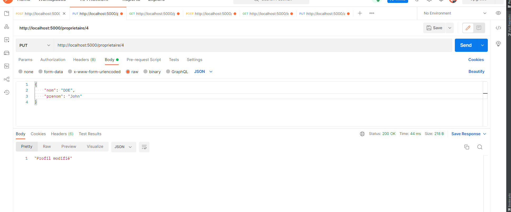

# Arcane
## Préparation de l'environnement de travail
### Environnement
<ol> 
  <li> Création du dossier pour le projet : mkdir  <i> nom du dossier </i> </li>
  <li> Accéder au dossier : cd  <i> nom du dossier </i> </li>
</ol>

### Installation des paquets 
<ul> 
  <li> Installation du framework Flask : <b> pip install flask </b> </li>  
  
  
  
   <li> Installation de l'environnement virtuel pour encloisoner les dépendances du projet  : <b> pip install virtualenv </b> -> <b> virtualenv venv </b> </li>  
  
  
  
   <li> Activation de l'environnement : <b> venv/Scripts/activate </b> </li>  
  
  
  
  <li> Installation de MySQL pour la gestion de la base de données : <b> pip install flask-mysql </b> </li>  
  
   
   
    <li> Installation de fask restful : qui permet la création rapide des services rest <b> pip install flask-restful </b> </li>  
  
   
  
  <li> Installation CORS pour le partage des ressources entre les domaines : <b> pip install cors </b> </li>
  
   
  
</ul>

### Conception 
<b> Modèle Conceptuel de données </b>

<section> 
  <ul><b> Notes :  </b>
    <li> Un proprietaire peut posséder 1 ou plusieurs biens immobiliers </li>
    <li> Un bien immobilier peut appartenir à aucun, un ou plusieurs proprétaires </li>
  </ul>
</section>

<b> Modèle Logique de données </b>

### Architecture du projet 

### Base de données :
<ol> 
  <li> Table immobilier </li>
  
  
  
  <li> Table proprietaire </li>
  
  
  
   <li> Table appartenir </li>
  
  
  
</ol>  

### Test des microservices
  <li> <b> Verbe : </b> POST </li>
  <li> <b> Paramètres :  </b> Information sur le proprietaire  </li>
  <li> <b> Retour :  </b> Status de l'exécution  </li>

  
  
  
  <li> <b> Verbe : </b> PUT </li>
  <li> <b> Paramètres :  </b> Information sur le proprietaire  </li>
  <li> <b> Retour :  </b> Status de l'exécution  </li>

  
  
  <li> <b> Verbe : </b> GET </li>
  <li> <b> Paramètres :  </b> Identifiant d'un proprietaire  </li>
  <li> <b> Retour :  </b> Information sur l'utilisateur  </li>

  
  
  <li> <b> Verbe : </b> POST </li>
  <li> <b> Paramètres :  </b> Information sur le bien immobilier et l'identifiant du proprietaire  </li>
  <li> <b> Retour :  </b> Status de l'exécution  </li>

  

  <li> <b> Verbe : </b> GET </li>
  <li> <b> Paramètres :  </b> Nom de la ville  </li>
  <li> <b> Retour :  </b> Information sur les biens se situant dans cette ville  </li>

  
  
  <li> <b> Verbe : </b> PUT </li>
  <li> <b> Paramètres :  </b> Identifiant du bien, identifiant du proprietaire  </li>
  <li> <b> Retour :  </b> Information du bien  </li>

  
>>>>>>> 2ba5dfc (Update README.md)
